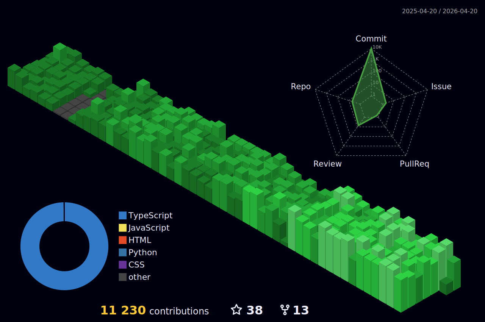

<p align="center">
  
</p>

<p align="center">
  <a href="https://git.io/typing-svg"></a>
</p>

<p align="center">
  <a href="https://github.com/wrujel">
    
  </a>
</p>

---

### 👋 About Me

```yaml
name: Wilfredo Rujel
location: Lima, Peru
company: SAP
role: Senior Software Engineer
interests:
  - Building scalable web applications
  - Competitive programming & algorithms
  - Open source contributions
currently:
  - Writing technical blog posts at wrujel.com/blog
  - Building developer tools & side projects
```

---

### 🛠️ Tech Stack

<p align="center">
  
</p>

---

<!-- PROJECTS_START -->
### 🚀 Featured Projects

<table>
<tr>
<td align="center" valign="top" width="50%">
<a href="https://github.com/wrujel/airbnb-clone"></a>
<br/>
<a href="https://github.com/wrujel/airbnb-clone"><b>airbnb-clone</b></a>
<br/><sub>Airbnb app clone with Next.js 13, that allows you to search for properties, a...</sub>
<br/><br/>
<sub>⭐ 26 &nbsp;•&nbsp; 🍴 12 &nbsp;•&nbsp; </sub>
</td>
<td align="center" valign="top" width="50%">
<a href="https://github.com/wrujel/portfolio-web-template"></a>
<br/>
<a href="https://github.com/wrujel/portfolio-web-template"><b>portfolio-web-template</b></a>
<br/><sub> This a project to create a web portfolio using Next.js 14, React, TypeScript...</sub>
<br/><br/>
<sub>⭐ 4 &nbsp;•&nbsp; 🍴 0 &nbsp;•&nbsp; </sub>
</td>
</tr>
<tr>
<td align="center" valign="top" width="50%">
<a href="https://github.com/wrujel/tesla-landing"></a>
<br/>
<a href="https://github.com/wrujel/tesla-landing"><b>tesla-landing</b></a>
<br/><sub>Tesla landing with Astro and Tailwind, fully responsive design.</sub>
<br/><br/>
<sub>⭐ 3 &nbsp;•&nbsp; 🍴 0 &nbsp;•&nbsp; </sub>
</td>
<td align="center" valign="top" width="50%">
<a href="https://github.com/wrujel/tetris-javascript"></a>
<br/>
<a href="https://github.com/wrujel/tetris-javascript"><b>tetris-javascript</b></a>
<br/><sub>A modern implementation of the classic Tetris game, built with JavaScript, po...</sub>
<br/><br/>
<sub>⭐ 1 &nbsp;•&nbsp; 🍴 1 &nbsp;•&nbsp; </sub>
</td>
</tr>
<tr>
<td align="center" valign="top" width="50%">
<a href="https://github.com/wrujel/netflix-clone"></a>
<br/>
<a href="https://github.com/wrujel/netflix-clone"><b>netflix-clone</b></a>
<br/><sub>App inspired by Netflix, built with Next.js, Typescript, Tailwind CSS, Next-A...</sub>
<br/><br/>
<sub>⭐ 2 &nbsp;•&nbsp; 🍴 0 &nbsp;•&nbsp; </sub>
</td>
<td width="50%"></td>
</tr>
</table>

<p align="right"><a href="https://wrujel.com/projects">🚀 More Projects →</a></p>
<!-- PROJECTS_END -->

---

<!-- BLOG_START -->
### ✍️ Latest Blog Posts

<table>
  <tr>
    <td width="60" align="center" valign="top"><a href="https://blog.wrujel.com/graceful-shutdown-nodejs-production-services-739770"></a></td>
    <td valign="top"><a href="https://blog.wrujel.com/graceful-shutdown-nodejs-production-services-739770"><b>Graceful Shutdown in Node.js Production Services</b></a><br><sub>Most Node.js services silently drop in-flight requests on every deploy. Here's h…</sub></td>
    <td align="right" valign="top" nowrap><sub>📅 Apr 18, 2026 · 🏷️ backend · ⏱ 5 min read</sub></td>
  </tr>
  <tr><td colspan="3" height="6"></td></tr>
  <tr>
    <td width="60" align="center" valign="top"><a href="https://blog.wrujel.com/composable-middleware-pipelines-typescript-017190"></a></td>
    <td valign="top"><a href="https://blog.wrujel.com/composable-middleware-pipelines-typescript-017190"><b>Composable Middleware Pipelines in TypeScript</b></a><br><sub>Stop bolting middleware onto frameworks and start building type-safe, composable…</sub></td>
    <td align="right" valign="top" nowrap><sub>📅 Apr 12, 2026 · 🏷️ backend · ⏱ 4 min read</sub></td>
  </tr>
  <tr><td colspan="3" height="6"></td></tr>
  <tr>
    <td width="60" align="center" valign="top"><a href="https://blog.wrujel.com/runtime-type-safety-zod-validation-boundaries-ed4ad0"></a></td>
    <td valign="top"><a href="https://blog.wrujel.com/runtime-type-safety-zod-validation-boundaries-ed4ad0"><b>Runtime Type Safety with Zod: Validating at Every Boundary</b></a><br><sub>TypeScript's type system stops at compile time — Zod closes the gap by validatin…</sub></td>
    <td align="right" valign="top" nowrap><sub>📅 Apr 11, 2026 · 🏷️ engineering · ⏱ 4 min read</sub></td>
  </tr>
  <tr><td colspan="3" height="6"></td></tr>
  <tr>
    <td width="60" align="center" valign="top"><a href="https://blog.wrujel.com/http-caching-cache-control-etags-cdn-strategies-cfce0a"></a></td>
    <td valign="top"><a href="https://blog.wrujel.com/http-caching-cache-control-etags-cdn-strategies-cfce0a"><b>HTTP Caching Demystified: Cache-Control, ETags, and CDN Strategies</b></a><br><sub>A practical guide to HTTP caching headers — what each directive actually does, w…</sub></td>
    <td align="right" valign="top" nowrap><sub>📅 Apr 4, 2026 · 🏷️ backend · ⏱ 4 min read</sub></td>
  </tr>
  <tr><td colspan="3" height="6"></td></tr>
  <tr>
    <td width="60" align="center" valign="top"><a href="https://blog.wrujel.com/react-server-actions-patterns-pitfalls-production-381b58"></a></td>
    <td valign="top"><a href="https://blog.wrujel.com/react-server-actions-patterns-pitfalls-production-381b58"><b>React Server Actions: Patterns, Pitfalls, and Production Use</b></a><br><sub>Server Actions bring form handling and mutations back to the server in Next.js —…</sub></td>
    <td align="right" valign="top" nowrap><sub>📅 Apr 1, 2026 · 🏷️ frontend · ⏱ 4 min read</sub></td>
  </tr>
  <tr><td colspan="3" height="6"></td></tr>
</table>

<p align="right"><a href="https://blog.wrujel.com/">📖 Read more →</a></p>
<!-- BLOG_END -->

---

<!-- LEETCODE_START -->
### 🧩 LeetCode Insights

> **3885** problems solved | **6** languages | **72** topics | **57%** avg acceptance

#### Difficulty Breakdown

| Difficulty | Solved | Progress |
|:-----------|-------:|:---------|
| 🟢 Easy | 936/936 | `████████████████████` 100.0% |
| 🟡 Medium | 2030/2030 | `████████████████████` 100.0% |
| 🔴 Hard | 919/919 | `████████████████████` 100.0% |

#### Top Languages

<table>
<tr><th>Language</th><th align="right">Problems</th><th align="right">Share</th></tr>
<tr><td>&nbsp;&nbsp;Rust</td><td align="right">3420</td><td align="right">88%</td></tr>
<tr><td>&nbsp;&nbsp;Pandas</td><td align="right">235</td><td align="right">6%</td></tr>
<tr><td>&nbsp;&nbsp;Sql</td><td align="right">103</td><td align="right">3%</td></tr>
<tr><td>&nbsp;&nbsp;Typescript</td><td align="right">67</td><td align="right">2%</td></tr>
<tr><td>&nbsp;&nbsp;Cpp</td><td align="right">56</td><td align="right">1%</td></tr>
</table>

<p align="right"><a href="https://leetcode-tracker-qvf.pages.dev/">📊 Full Dashboard →</a></p>
<!-- LEETCODE_END -->

---

<!--
### 📊 GitHub Stats

<p align="center">
  <a href="https://github.com/wrujel">
    
    
  </a>
</p>

<p align="center">
  <a href="https://github.com/wrujel">
    
  </a>
</p>
-->

<!-- --- -->

<!--
### 🏆 GitHub Trophies

<p align="center">
  
</p>
-->

<!-- --- -->

### 📈 Contribution Graph

<p align="center">
  
</p>

---

<p align="center">
  
</p>
