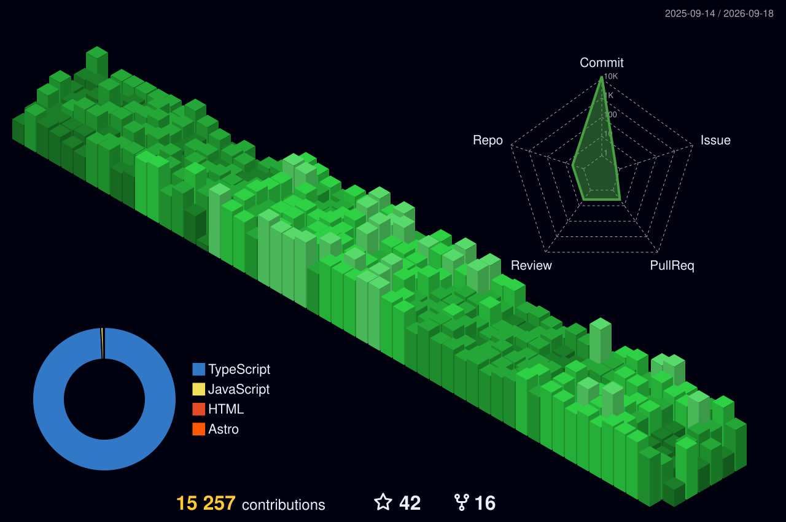

<p align="center">
  
</p>

<p align="center">
  <a href="https://git.io/typing-svg"></a>
</p>

<p align="center">
  <a href="https://github.com/wrujel">
    
  </a>
</p>

---

### 👋 About Me

```yaml
name: Wilfredo Rujel
location: Lima, Peru
company: SAP
role: Senior Software Engineer
interests:
  - Building scalable web applications
  - Competitive programming & algorithms
  - Open source contributions
currently:
  - Writing technical blog posts at wrujel.com/blog
  - Building developer tools & side projects
```

---

### 🛠️ Tech Stack

<p align="center">
  
</p>

---

<!-- PROJECTS_START -->
### 🚀 Featured Projects

<table>
<tr>
<td align="center" valign="top" width="50%">
<a href="https://leetcode.wrujel.website/"></a>
<br/>
<a href="https://leetcode.wrujel.website/"><b>leetcode-ui</b></a>
<br/><sub>Personal LeetCode progress dashboard built with Astro 7, React 19, and Tailwi...</sub>
<br/><br/>
<sub>⭐ 0 &nbsp;•&nbsp; 🍴 0 &nbsp;•&nbsp; </sub>
</td>
<td align="center" valign="top" width="50%">
<a href="https://wrujel.com"></a>
<br/>
<a href="https://wrujel.com"><b>portfolio</b></a>
<br/><sub>Personal developer portfolio built with Next.js 16, TypeScript, and Tailwind ...</sub>
<br/><br/>
<sub>⭐ 0 &nbsp;•&nbsp; 🍴 0 &nbsp;•&nbsp; </sub>
</td>
</tr>
<tr>
<td align="center" valign="top" width="50%">
<a href="https://blog.wrujel.com"></a>
<br/>
<a href="https://blog.wrujel.com"><b>blog</b></a>
<br/><sub>A developer blog built with Next.js 16, featuring file-based MDX content powe...</sub>
<br/><br/>
<sub>⭐ 0 &nbsp;•&nbsp; 🍴 0 &nbsp;•&nbsp; </sub>
</td>
<td align="center" valign="top" width="50%">
<a href="https://github.com/wrujel/webpage-gpt"></a>
<br/>
<a href="https://github.com/wrujel/webpage-gpt"><b>webpage-gpt</b></a>
<br/><sub>Cinematic GPT-Bot landing page with a GSAP scroll-story hero and a WebGL auro...</sub>
<br/><br/>
<sub>⭐ 0 &nbsp;•&nbsp; 🍴 0 &nbsp;•&nbsp; </sub>
</td>
</tr>
<tr>
<td align="center" valign="top" width="50%">
<a href="https://github.com/wrujel/admin-dashboard-next"></a>
<br/>
<a href="https://github.com/wrujel/admin-dashboard-next"><b>admin-dashboard-next</b></a>
<br/><sub>Real-time admin dashboard with generic data tables, animated charts and a liv...</sub>
<br/><br/>
<sub>⭐ 0 &nbsp;•&nbsp; 🍴 0 &nbsp;•&nbsp; </sub>
</td>
<td align="center" valign="top" width="50%">
<a href="https://github.com/wrujel/django-crud-react"></a>
<br/>
<a href="https://github.com/wrujel/django-crud-react"><b>django-crud-react</b></a>
<br/><sub>Full-stack task manager with drag-and-drop ordering, live filters and a stats...</sub>
<br/><br/>
<sub>⭐ 2 &nbsp;•&nbsp; 🍴 0 &nbsp;•&nbsp; </sub>
</td>
</tr>
</table>

<p align="right"><a href="https://wrujel.com/projects">🚀 More Projects →</a></p>
<!-- PROJECTS_END -->

---

<!-- BLOG_START -->
### ✍️ Latest Blog Posts

<table width="100%">
  <tr>
    <td width="76" align="center" valign="top"><a href="https://blog.wrujel.com/designing-idempotent-background-jobs-retries-locks-exactly-once-illusion-e1f557"></a></td>
    <td valign="top"><a href="https://blog.wrujel.com/designing-idempotent-background-jobs-retries-locks-exactly-once-illusion-e1f557"><b>Designing Idempotent Background Jobs: Retries, Locks, and the Exactly-Once Illusion</b></a><br><sub>Exactly-once processing doesn't exist in distributed systems—here's how to desig…</sub></td>
    <td align="right" valign="top"><sub>📅 Aug 26, 2026</sub><br><sub><code>backend</code></sub><br><sub>⏱ 5 min read</sub></td>
  </tr>
  <tr><td colspan="3" height="6"></td></tr>
  <tr>
    <td width="76" align="center" valign="top"><a href="https://blog.wrujel.com/postgres-materialized-views-tradeoffs-production-0d1d35"></a></td>
    <td valign="top"><a href="https://blog.wrujel.com/postgres-materialized-views-tradeoffs-production-0d1d35"><b>Materialized Views in Postgres: Trading Freshness for Speed</b></a><br><sub>How to use materialized views to speed up expensive aggregations in Postgres wit…</sub></td>
    <td align="right" valign="top"><sub>📅 Aug 22, 2026</sub><br><sub><code>backend</code></sub><br><sub>⏱ 5 min read</sub></td>
  </tr>
  <tr><td colspan="3" height="6"></td></tr>
  <tr>
    <td width="76" align="center" valign="top"><a href="https://blog.wrujel.com/idempotency-keys-in-practice-safe-retries-4da26e"></a></td>
    <td valign="top"><a href="https://blog.wrujel.com/idempotency-keys-in-practice-safe-retries-4da26e"><b>Idempotency Keys in Practice: Making Retries Safe</b></a><br><sub>How to design and implement idempotency keys so retried requests never double-ch…</sub></td>
    <td align="right" valign="top"><sub>📅 Aug 15, 2026</sub><br><sub><code>backend</code></sub><br><sub>⏱ 5 min read</sub></td>
  </tr>
  <tr><td colspan="3" height="6"></td></tr>
  <tr>
    <td width="76" align="center" valign="top"><a href="https://blog.wrujel.com/cancellation-patterns-typescript-abortcontroller-28219a"></a></td>
    <td valign="top"><a href="https://blog.wrujel.com/cancellation-patterns-typescript-abortcontroller-28219a"><b>Cancellation Patterns in TypeScript: Taming AbortController</b></a><br><sub>Why most async TypeScript code ignores cancellation entirely, and how to build c…</sub></td>
    <td align="right" valign="top"><sub>📅 Aug 8, 2026</sub><br><sub><code>engineering</code></sub><br><sub>⏱ 4 min read</sub></td>
  </tr>
  <tr><td colspan="3" height="6"></td></tr>
  <tr>
    <td width="76" align="center" valign="top"><a href="https://blog.wrujel.com/multi-region-database-failover-lessons-production-9d47a1-f4c405"></a></td>
    <td valign="top"><a href="https://blog.wrujel.com/multi-region-database-failover-lessons-production-9d47a1-f4c405"><b>Multi-Region Database Failover: What Actually Breaks in Production</b></a><br><sub>Multi-region failover looks simple on an architecture diagram — the reality invo…</sub></td>
    <td align="right" valign="top"><sub>📅 Aug 8, 2026</sub><br><sub><code>architecture</code></sub><br><sub>⏱ 5 min read</sub></td>
  </tr>
  <tr><td colspan="3" height="6"></td></tr>
</table>

<p align="right"><a href="https://blog.wrujel.com/">📖 Read more →</a></p>
<!-- BLOG_END -->

---

<!-- LEETCODE_START -->
### 🧩 LeetCode Insights

> **3921** problems solved | **6** languages | **72** topics | **57%** avg acceptance

#### Difficulty Breakdown

| Difficulty | Solved | Progress |
|:-----------|-------:|:---------|
| 🟢 Easy | 944/944 | `████████████████████` 100.0% |
| 🟡 Medium | 2048/2050 | `████████████████████` 99.9% |
| 🔴 Hard | 929/930 | `████████████████████` 99.9% |

#### Top Languages

<table>
<tr><th>Language</th><th align="right">Problems</th><th align="right">Share</th></tr>
<tr><td>&nbsp;&nbsp;Rust</td><td align="right">3456</td><td align="right">88%</td></tr>
<tr><td>&nbsp;&nbsp;Pandas</td><td align="right">235</td><td align="right">6%</td></tr>
<tr><td>&nbsp;&nbsp;Sql</td><td align="right">103</td><td align="right">3%</td></tr>
<tr><td>&nbsp;&nbsp;Typescript</td><td align="right">67</td><td align="right">2%</td></tr>
<tr><td>&nbsp;&nbsp;Cpp</td><td align="right">56</td><td align="right">1%</td></tr>
</table>

<p align="right"><a href="https://leetcode.wrujel.website/">📊 Full Dashboard →</a></p>
<!-- LEETCODE_END -->

---

<!--
### 📊 GitHub Stats

<p align="center">
  <a href="https://github.com/wrujel">
    
    
  </a>
</p>

<p align="center">
  <a href="https://github.com/wrujel">
    
  </a>
</p>
-->

<!-- --- -->

<!--
### 🏆 GitHub Trophies

<p align="center">
  
</p>
-->

<!-- --- -->

### 📈 Contribution Graph

<p align="center">
  
</p>

---

<p align="center">
  
</p>
